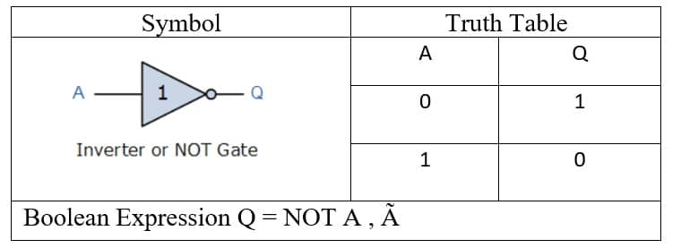

# Logical Operators
> We have three type of Logical Operators.

1. (&&) Logical AND: It's work is when we have both conditions are true then that the value is printable.
And when we have first condition is ture and second is false then that the value is not printable.
let's see :
This is Binary Numbers
>It's multiplication.

|Input|Input|Output|
|---------|----|---|
|        0|   0|  0|
|        0|   1|  0| 
|        1|   0|  0|
|        1|   1|  1|

```javascript
// It's will be printed true cause both conditions are valid and the age declaration is also between in the range of conditions.
let age=21;
if(age>=18 && age<=21){
    console.log(true);
}else{
    console.log(false);
}
```
2. (||) Logical OR : When we have have both conditions are true or first condition is true and second condition is false so also its give the value is true or printable.
let's see :
This is Binary Numbers
>It's Addition

|Input|Input|Output|
|---------|----|---|
|        0|   0|  0|
|        0|   1|  1| 
|        1|   0|  1|
|        1|   1|  1|

here: 1+1 = 2, and 2's binary is 10 and 1 is carry and 0 is borrow so this reason we write 1+1=1 in binary.

```javascript
// It's will be give false cause both conditions are outof range of our input value who's 50.
let num=50;
if(num<=18 || num<=21){
    console.log(true);
}else{
    console.log(false);
}
```

3. (!) Logical NOT : When we have have both conditions are true or first condition is true and second condition is false so also its give the value is true or printable.
let's see :
This is Binary Numbers
>It's  a reverse the value

|Input|Input|Output|
|---------|----|---|
|        0|   0|  1|
|        0|   1|  1| 
|        1|   0|  1|
|        1|   1|  0|



```javascript
// It's will be give us false cause 30 is grater than 12 it's true but this operator give the output in reverse form.

let number=30;

if(!number>=12){
    console.log(true);
}else{
    console.log(false);
}
```

Click on link for more knowledge [If Statement](../js/13.Logical%20Operators.js)